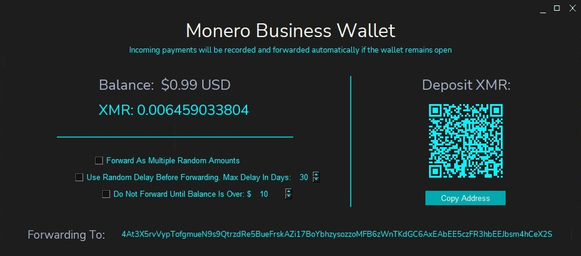

# Monero_Business_Wallet

The customer sends Monero, you recieve cash in your bank account. (IN PROGRESS! DO NOT USE YET!)

    

## Mission Statement
The goal of this project is to reduce the barrier to entry for merchants, and increase acessability/usage of Monero by creating a simple, user-friendly way for merchants to accept XMR and receive USD. 

# How It Works: 
* Launch the wallet
* Select if you would like to have recieved Monero auto-forwarded to cold storage, or converted to a stable coin and auto-forwarded to an exchange (where it can be sold for USD).
* Select additional privacy settings

# How To Use:
* Make sure you have [Python 3.8](https://www.python.org/downloads/) or newer installed
* [Download the Monero Business Wallet files](https://github.com/lukeprofits/Monero_Business_Wallet/archive/refs/heads/main.zip) extract all the files from the .zip you downloaded and put them in a folder
* [Download the Monero CLI Wallet](https://www.getmonero.org/downloads/#cli), extract all the files from the .zip you downloaded and put them in the same folder
  
* Optional: Download and install [the font Nunito Sans](https://fonts.google.com/specimen/Nunito+Sans)
* On Windows, double click the "Windows_Launcher" file
* On Mac/Linux, run the "Mac_Linux_Launcher" file 
* Or if you are comfortable with the terminal, on any OS open your console and enter the command: `python Monero_Business_Wallet.py`
* On Linux there are some required clipboard packages. For non-wayland sessions they are: xclip and xsel, for wayland sessions it is: wl-clipboard. Make sure to install them with your package manager.
* Configure your settings & leave it running

## Practical Goals

* Be incredibly user friendly

* Have the value sent by the customer (as XMR), and the value recieved by the merchant (in USD) lose less than credit card processing fees (3%).

* Remain as decentralized as possible.
  
* Include all useful tax information needed for merchants.

* Protect privacy as much as possible.

## Legal Disclaimer

By downloading, using or distributing this software, **you acknowledge that you are doing so in a jurisdiction that legally permits such activities**. The software is created with the intention of legal use. The author of this software is not responsible for the actions of its users, and users are fully responsible for ensuring that their use of the software complies with local, state, national, and international law.

**It is the responsibility of the user to investigate and ensure the legality of the software** under all relevant laws of the jurisdictions in which they reside and use the software. The author does not make any representations or warranties regarding the legality of this software in any given jurisdiction, and expressly disclaims any liability for the use of the software in any jurisdiction.

This software has functionality that could potentially be used to bypass geo-restrictions through the use of proxies. **This feature is included for privacy-conscious users who wish to maintain their privacy** through the use of VPNs or other tools, not to facilitate illegal activities. Users who utilize these features are responsible for their own compliance with laws regarding the use of such technologies.

Use of the software's cryptocurrency transaction features, including but not limited to the tracking, conversion, and management of Monero, USDC, USDT, or other cryptocurrencies, **must comply with all applicable laws and regulations**. **If you select to convert received Monero, the Monero Business Wallet uses non-KYC swap services to convert Monero to stable coins. It is the user's responsibility to NOT use this function if non-KYC swaps are not legal in their country.** Users are solely responsible for their own tax compliance and reporting, and any legal issues arising from their use of cryptocurrencies.

By using this software, **you agree to indemnify and hold harmless the author from any legal claims or disputes** that may arise from your use of the software.

You acknowledge that use of this software carries inherent risks, including but not limited to financial loss. You agree that you are using this software at your own risk, and accept full responsibility for any and all consequences, including financial loss, arising from your use of the software.

In the event that any liability is imposed on the author despite the above disclaimers, you agree that the author's maximum aggregate liability to you will not exceed $0.

> :warning: **Remember: Use this software responsibly, in accordance with all applicable laws and regulations. The author does not condone or support illegal activities.**

## User Agreement

By using this software, you agree to the following:

1. You will use this software in compliance with all local, state, national, and international laws and regulations.
2. You acknowledge that the author of the software does not encourage or condone illegal activities.
3. You agree to use the software's features, including the cryptocurrency transaction features and geo-restriction bypassing features, responsibly and legally.
4. You understand that the Monero Business Wallet uses non-KYC swap services to convert Monero to stable coins and it's your responsibility to not use this function if non-KYC swaps are not legal in your country.
5. You accept that the author of the software is not responsible for any legal issues that arise from your use of the software and agree to hold the author harmless from any such issues.
6. You understand and accept that the author does not guarantee the legality of the software in any jurisdiction and is not responsible for determining whether the software is legal for you to use.
7. You acknowledge that use of this software carries inherent risks, including but not limited to financial loss. You agree that you are using this software at your own risk, and accept full responsibility for any and all consequences, including financial loss, arising from your use of the software.
